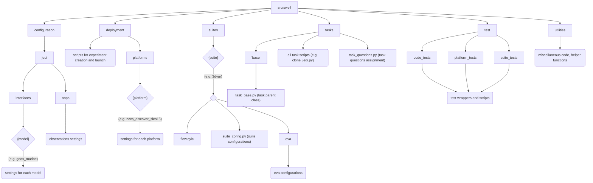

```mermaid
flowchart TD
  AA[src/swell] --> A[configuration] --> B[jedi] --> C[oops]
  B --> D[interfaces]
  D --> E{"{model}"} --"(e.g. geos_marine)" --> F(settings for each model)
  C --> G(observations settings)

  AA --> BA[deployment] --> BB(scripts for experiment creation and launch)
  BA --> BC[platforms] --> BD{"{platform}"} -- "(e.g. nccs_discover_sles15)" --> BE(settings for each platform)
  AA --> CA[suites] --> CZ{"{suite}"} -- "(e.g. 3dvar)" --> CB{" "} --> CC["flow.cylc"]
  CB --> CD["suite_config.py (suite configurations)"]
  CB --> CE["eva"] --> CF("eva configurations")

  AA --> DA[tasks] --> DB['base'] --> DC["task_base.py (task parent class)"]
  DA --> DD("all task scripts (e.g. clone_jedi.py)")
  DA --> DE["task_questions.py (task questions assignment)"]

  AA --> EA[test] --> EB[code_tests]
  EA --> EC[platform_tests]
  EA --> ED[suite_tests]

  EB --> EZ("test wrappers and scripts")
  EC --> EZ
  ED --> EZ

  AA --> FA[utilities] --> FB("miscellaneous code, helper functions")

```
